# INVOICE - BOOK 1

Panel tally guide

## Rule

Track the book by absolute panel number, not by cube.

Panel ID format:

`B1-P##-F#`

Meaning:

1. `B1` = Book 1
2. `P##` = page number
3. `F#` = panel/face number on that page

Pages 1-51 have six panels each.

Page 52 has seven panels.

Total: 313 panels.

## Formula

For Pages 1-51:

`absolute panel = ((page - 1) x 6) + panel_on_page`

For Page 52:

`absolute panel = 306 + panel_on_page`

Examples:

1. `B1-P01-F1` = panel 1
2. `B1-P14-F6` = panel 84
3. `B1-P15-F1` = panel 85
4. `B1-P18-F6` = panel 108
5. `B1-P52-F7` = panel 313

## Current Position

We have conceptually built through Page 14:

Panels 1-84: dot, line, box, cube.

Next active section:

Panels 85-108: Pages 15-18, Growing Grid.

This is not many literal cubes. It is a slow-growing abstract grid: one line crossed by another, incomplete cells, repeated right angles, offset corners, displaced planes, nested perspective lines.

## Scene Ranges

| Scene | Pages | Panels | Name |
|---:|---:|---:|---|
| 1 | 1-3 | 1-18 | Point |
| 2 | 4-6 | 19-36 | Line |
| 3 | 7-9 | 37-54 | Box |
| 4 | 10-14 | 55-84 | Cube |
| 5 | 15-18 | 85-108 | Growing Grid |
| 6 | 19-22 | 109-132 | Growth Pressure / Planes and Corners |
| 7 | 23-26 | 133-156 | Wood |
| 8 | 27-30 | 157-180 | The Seam |
| 9 | 31-34 | 181-204 | Sliver |
| 10 | 35-38 | 205-228 | Break |
| 11 | 39-42 | 229-252 | Dark Home-Space |
| 12 | 43-45 | 253-270 | Follow the Line |
| 13 | 46-48 | 271-288 | Humming Door |
| 14 | 49-51 | 289-306 | At the Threshold |
| 15 | 52 | 307-313 | First Paragraph / Seventh Panel |

## Diagram

```mermaid
flowchart LR
  A["1-18<br/>Point"] --> B["19-36<br/>Line"]
  B --> C["37-54<br/>Box"]
  C --> D["55-84<br/>Cube"]
  D --> E["85-108<br/>Growing Grid"]
  E --> F["109-132<br/>Growth Pressure"]
  F --> G["133-156<br/>Wood"]
  G --> H["157-180<br/>Seam"]
  H --> I["181-204<br/>Sliver"]
  I --> J["205-228<br/>Break"]
  J --> K["229-252<br/>Dark Home-Space"]
  K --> L["253-270<br/>Follow the Line"]
  L --> M["271-288<br/>Humming Door"]
  M --> N["289-306<br/>Threshold"]
  N --> O["307-313<br/>First Paragraph / Seventh Panel"]
```

## Working Tally Habit

When drafting or generating an image, name all three:

1. Absolute panel number
2. Panel ID
3. Scene name

Example:

`Panel 85 / B1-P15-F1 / Growing Grid`

This keeps the 313-panel system navigable.
